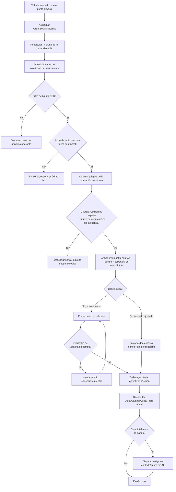

# Bot de Trading Cuantitativo de Opciones GGAL — Diseño de Arquitectura y Lógica

**Enfoque:** Volatilidad, delta-neutralidad y gestión de griegas (filosofía Ricardo Sáenz de Heredia) aplicada a la cadena de opciones de GGAL en BYMA.

---

## Resumen ejecutivo

Este documento especifica un bot de opciones sobre GGAL cuyo objetivo no es predecir la dirección del subyacente, sino explotar descalibres entre la volatilidad implícita (IV) que el mercado le pone a cada base y la volatilidad "justa" (histórica ajustada y curva suavizada), manteniendo el libro delta-neutral mediante cobertura dinámica con la acción y, cuando exista, el futuro. El bot compra IV barata, vende IV cara, cobra theta cuando la gamma lo permite, y se protege con límites duros de riesgo y filtros de liquidez propios de un mercado emergente con libros finos como BYMA.

El documento se organiza en dos fases: (1) el marco teórico-estratégico que gobierna las decisiones, y (2) la especificación técnica del sistema, con diagrama de flujo, código Python base y un checklist de validación específico para GGAL.

---

## FASE 1 — Marco teórico y estratégico

### 1.1. Volatilidad implícita (IV) vs. volatilidad histórica (HV): descalibres en GGAL

**Por qué GGAL es el subyacente correcto para este enfoque en Argentina.** Es la única cadena de opciones de acciones locales con suficiente profundidad y variedad de bases/vencimientos como para sostener un libro de volatilidad razonable. Aun así, comparado con mercados desarrollados, el smile de GGAL es ruidoso: pocos participantes, spreads bid/ask amplios en bases OTM, y saltos de IV por micro-noticias (BCRA, tipo de cambio, ADR de GGAL en NYSE que arbitra contra la local).

**Metodología para detectar descalibres:**

1. **HV multi-ventana.** Calcular volatilidad histórica realizada con varias ventanas (5, 10, 20, 60 ruedas) y con dos estimadores: close-to-close (simple, ruidoso) y Parkinson/Garman-Klass si hay datos de máximo/mínimo intradiario (más eficiente, reduce el ruido de una sola muestra por día). El objetivo no es "la" HV sino una banda: HV mínima–máxima reciente, que sirve de ancla.

2. **HV ajustada por eventos.** GGAL cotiza como ADR en NYSE; el bot debe incorporar la volatilidad implícita del ADR (si está disponible vía datos públicos) y el calendario de balances de Grupo Financiero Galicia como "IV bump" esperado, para no confundir una suba de IV pre-balance con un descalibre real explotable (esa suba está justificada y se debe dejar pasar, no arbitrar).

3. **Curva de IV (term structure) y smile por vencimiento.** Para cada vencimiento vigente en BYMA (mensual, y a veces bimestral), construir la curva de IV por strike usando el mid-price de cada base (ver 2.1 en Fase 2). Ajustar una función suave (spline cuadrático o SVI simplificado) sobre estas IVs "crudas" — esto evita operar contra un solo dato de punta corrida por iliquidez.

4. **Señal de descalibre.** Un strike es candidato quia trading cuando su IV cruda se aparta de la IV suavizada de la curva en más de un umbral (ej. 3–5 vol points, calibrado empíricamente porque el spread relativo de las bases de GGAL es alto) **y** simultáneamente la IV suavizada de todo el vencimiento se aparta de la banda de HV reciente en la misma dirección. Es decir: se opera la diferencia *IV cruda vs. IV de curva* (arbitraje de smile, delta-neutral, sin apuesta direccional de volatilidad) con más confianza que la diferencia *IV vs. HV* (que sí es una apuesta sobre el nivel futuro de volatilidad y debe manejarse con menor tamaño).

5. **Régimen de tasa.** En Argentina la tasa de interés implícita en la paridad put-call (ver 1.3) es en sí misma una señal de dislocación: si el forward implícito por opciones se aleja del forward "razonable" (tasa de call money / caución vigente), conviene tratar esa pata como arbitraje de tasa antes que como arbitraje de volatilidad puro.

### 1.2. Gestión dinámica de griegas

**Delta.** El delta de cada posición y el delta total de la cuenta (en "equivalente acciones GGAL") es la variable de control principal. El bot no tiene vista direccional: todo delta remanente por fuera de una banda de tolerancia es riesgo no compensado y debe cerrarse comprando/vendiendo el subyacente (contado GGAL, o futuro de GGAL cuando exista y tenga liquidez suficiente — el futuro evita el costo de comisión/impuesto a los créditos y debitos y libera capital, pero en BYMA su liquidez es intermitente, por lo que el bot debe tener ambas rutas de cobertura y elegir según spread y profundidad disponible en el momento).

**Gamma.** La gamma mide cuán rápido cambia el delta. Cerca del vencimiento (últimos 5-7 días hábiles) la gamma de las bases ATM se dispara: pequeños movimientos del subyacente generan grandes cambios de delta, obligando a rehedgear con mucha frecuencia (y a pagar mucho spread haciéndolo). El bot debe: (a) reducir el umbral de rebalanceo de delta a medida que se acerca el vencimiento (rehedgear más seguido con menos margen), o alternativamente (b) reducir el tamaño de la posición gamma (cerrar o rolear a la serie siguiente) cuando la gamma proyectada por punto de movimiento supere un límite de riesgo en pesos. Gamma corta (vendida) sin límite es la fuente clásica de blow-up en este tipo de estrategias — el sizing de gamma neta es, junto con vega, el límite duro más importante del sistema.

**Theta.** Es la retribución por vender opciones (o por posiciones netas cortas en volatilidad): el bot cobra theta día a día si el movimiento realizado del subyacente es menor al implícito por las opciones vendidas. La métrica de control no es theta en aislado sino el cociente theta/gamma (cuánto se cobra por unidad de riesgo de aceleración) y la comparación permanente entre movimiento realizado intradiario y el "breakeven" que impone la posición gamma (regla clásica de "gamma scalping": si el subyacente se mueve más que el breakeven diario, el gamma larga gana; si se mueve menos, gana la gamma corta que cobra theta).

**Vega.** Sensibilidad al nivel de IV de todo el libro. A diferencia de delta y gamma, vega no se cubre con el subyacente sino con otras opciones (o dejándola correr dentro de un límite). El bot debe mantener vega total acotada en pesos por punto de vol, y trackear la vega por vencimiento por separado (vega del mes corriente vs. vega del mes siguiente no son intercambiables: son exposiciones a curvas de IV distintas). Una posición delta-neutral y gamma-neutral puede seguir teniendo un riesgo de vega enorme si está, por ejemplo, larga calendars.

### 1.3. Arbitrajes y estrategias estructuradas

- **Bull/Bear spreads (verticales).** Comprar una base y vender otra del mismo vencimiento para expresar una vista de smile (comprar la IV relativamente barata, vender la relativamente cara) con delta acotado y menor consumo de garantía que una posición desnuda.
- **Calendars (spreads de vencimiento).** Vender el vencimiento cercano (más theta, más gamma) y comprar el lejano (más vega, menos gamma) en el mismo strike, cuando la curva de term structure de IV está invertida o demasiado plana respecto de lo razonable. Requiere trackear vega por pata, ya que no es gamma-vega neutral automáticamente.
- **Ratios.** Comprar n y vender m>n opciones (o viceversa) del mismo strike/vencimiento para lograr una exposición gamma/vega deseada con delta inicial bajo; usados para monetizar un sesgo de smile fuerte en un lado de la cadena, asumiendo el riesgo de cola que dejan las patas descubiertas (deben tener límite de tamaño y stop de gamma).
- **Paridad put-call y futuro sintético (tasa implícita en ARS).** `Call − Put = S − K·e^(−r·t)` (o su versión discreta con la tasa de caución/badlar vigente y el día hábil de vencimiento). El bot debe calcular continuamente la tasa implícita que surge de comparar el spread call-put contra el forward de mercado (contado/futuro): si esa tasa implícita se aleja significativamente de la tasa de caución observable, existe un arbitraje de tasa (comprar el sintético barato — combinación call+put+cobertura — y vender el caro) prácticamente sin riesgo de volatilidad, sujeto a costos de transacción, ejercicio anticipado (las opciones en BYMA son de tipo americano) y encaje de garantías.

---

## FASE 2 — Especificación técnica del bot

### 2.1. Arquitectura modular (visión general)

```
┌─────────────────────────────────────────────────────────────────────────┐
│                            CAPA DE DATOS                                 │
│  MarketDataFeed (PyRofex / WS FIX BYMA)                                 │
│   → puntas de GGAL contado + futuro                                    │
│   → puntas de toda la cadena de opciones (calls y puts, todas bases)   │
└───────────────────────────────┬───────────────────────────────────────┘
                                │  OrderBookSnapshot (bid/ask/size, ts)
                                ▼
┌─────────────────────────────────────────────────────────────────────────┐
│                       MOTOR DE CÁLCULO CUANTITATIVO                     │
│  ImpliedVolatilityCalculator (Newton-Raphson + bisección fallback)      │
│  BlackScholesGreeks (delta, gamma, vega, theta, rho — tasa ARS,        │
│                       día hábil/corrido, americano vs europeo)         │
│  VolatilitySurface (smile suavizado por vencimiento, IV vs HV)         │
│  PortfolioGreeks (agregación de griegas de toda la cuenta)             │
└───────────────────────────────┬───────────────────────────────────────┘
                                │  Signals (descalibres, delta excedido, etc.)
                                ▼
┌─────────────────────────────────────────────────────────────────────────┐
│                    MOTOR DE DECISIÓN Y EJECUCIÓN                        │
│  VolArbStrategy (comprar IV baja / vender IV alta, spreads, calendars) │
│  DeltaHedger (rebalanceo con contado/futuro GGAL)                      │
│  MarketMakingEngine (mid-price, cotización en bases ilíquidas)         │
│  RiskManager (stops de vega/gamma, filtros de liquidez, garantías)     │
└───────────────────────────────┬───────────────────────────────────────┘
                                │  Órdenes (alta/baja/modificación)
                                ▼
┌─────────────────────────────────────────────────────────────────────────┐
│                    OMS / EXECUTION GATEWAY (PyRofex REST/WS)           │
│  Envío, tracking de estado, manejo de fills parciales, reconciliación  │
└─────────────────────────────────────────────────────────────────────────┘
```

### 2.2. Data feed y preprocesamiento

- **Conexión.** `pyRofex` (o el gateway FIX/REST del ALYC) en modo websocket para md (market data) y order routing. Se suscribe a: GGAL contado, futuro GGAL (si cotiza con volumen), y todas las bases de calls y puts vigentes (2-3 vencimientos hacia adelante).
- **Matriz de puntas.** Estructura en memoria (`OrderBookSnapshot`) por instrumento: mejor bid/ask, tamaño en cada punta, timestamp de último update. Se recalcula el mid-price (`(bid+ask)/2`) y el spread relativo en cada evento; instrumentos sin puntas de ambos lados, o con spread relativo por encima de un umbral, se marcan como "no operables" para ese ciclo.
- **Curva de volatilidad.** Por cada vencimiento, se toma el mid-price de cada base con puntas válidas, se invierte Black-Scholes (ajustado por tasa de referencia ARS —caución/badlar— y por convención de días: BYMA licita en días corridos hasta el vencimiento pero el bot debe ponderar también días hábiles para el componente de theta/gamma intradía) para obtener la IV cruda por strike, y se ajusta una curva suave (ver `VolatilitySurface` en el código).

### 2.3. Motor de cálculo cuantitativo

- **IV por opción en tiempo real:** Newton-Raphson (rápido, converge en pocas iteraciones cuando vega no es casi nula) con caída a bisección (robusto, no diverge) cuando Newton-Raphson no converge — típico en opciones muy ITM/OTM donde vega es chica y la derivada es inestable.
- **Griegas por opción y por portafolio:** cada posición aporta sus griegas ponderadas por tamaño (y por el multiplicador del contrato, 100 en BYMA); el motor agrega delta total (en acciones equivalentes), gamma total (cambio de delta por punto de GGAL), vega total (por punto de vol) y theta total (por día) de toda la cuenta, y también desagregado por vencimiento (crítico para vega, como se explicó en 1.2).

### 2.4. Reglas de inserción de órdenes y market making

- **Señal de arbitraje de volatilidad:** comprar la base cuya IV cruda esté por debajo de la curva suavizada en más del umbral (barata), vender la que esté por encima (cara), siempre armando la operación de forma delta-neutral (agregando la cobertura de delta de esa opción específica al momento de armar la orden, no después).
- **Ejecución a mid-price:** en bases ilíquidas (spread ancho, poco volumen) el bot no cruza el spread; coloca la orden en el punto medio entre bid y ask (redondeado al tick permitido) y espera fill, capturando parte del spread en vez de pagarlo. Se define un tiempo máximo de exposición de la orden (ej. reintentar con mejora de precio cada N segundos) para no quedar "colgado" en un mercado que se mueve.
- **Rebalanceo de delta:** si `|Delta_total| > umbral` (p. ej. 150 acciones equivalentes de GGAL, calibrable por tamaño de cuenta y volatilidad reciente), el bot dispara una orden de cobertura en el contado (o futuro, el que tenga mejor combinación de spread/profundidad en ese momento) por la cantidad necesaria para volver dentro de la banda — no necesariamente a cero, para no sobre-operar por ruido.

### 2.5. Gestión del riesgo y constraints técnicos

- **Stop-loss por descalce de vega/gamma:** límites duros en pesos por punto de vol (vega) y en pesos por punto de movimiento del subyacente al cuadrado (gamma); al tocarlos, el bot deja de abrir posición nueva y empieza a reducir la pata más riesgosa, no espera a que se corrija sola.
- **Ejercicio y garantías:** las opciones americanas de BYMA pueden ejercerse anticipadamente (relevante en dividendos/eventos de GGAL); el bot debe modelar el riesgo de asignación en posiciones cortas ITM cerca de esos eventos y trackear el consumo de garantías (margin) reportado por el ALYC para no quedar sub-garantizado ante un movimiento fuerte.
- **Filtros de liquidez mínima:** antes de abrir cualquier posición nueva se valida volumen operado reciente y profundidad del libro (tamaño disponible en punta) de esa base específica; bases que no cumplen el mínimo quedan fuera del universo operable aunque su IV parezca atractiva (el descalibre puede ser sólo apariencia por falta de updates de precio).

### 2.6. Diagrama de flujo — ciclo de vida de una orden



---

## Código base (Python)

El módulo `quant_engine.py` (adjunto por separado) contiene la implementación orientada a objetos de:

- `BlackScholesGreeks`: pricing y griegas (delta, gamma, vega, theta, rho), europeo con ajuste de tasa ARS y convención de días.
- `ImpliedVolatilityCalculator`: solver de IV con Newton-Raphson y fallback a bisección.
- `VolatilitySurface`: construcción y suavizado del smile por vencimiento, señal IV vs HV.
- `HistoricalVolatility`: estimadores close-to-close y Parkinson.
- `Position` / `Portfolio`: representación de posiciones y agregación de griegas totales (por cuenta y por vencimiento).
- `DeltaHedger`: lógica de rebalanceo de delta con umbral configurable.
- `MarketMakingEngine`: cálculo de mid-price, tick rounding, y decisión agresiva vs. pasiva según liquidez.
- `RiskManager`: límites de vega/gamma, filtros de liquidez mínima, chequeo de garantías.
- `VolatilityArbitrageStrategy`: orquesta la detección de descalibres y arma órdenes delta-neutrales.

Ver el archivo de código para el detalle línea por línea; incluye un bloque `if __name__ == "__main__"` con un caso de prueba numérico (opción ATM de GGAL) que valida paridad put-call, consistencia de griegas y convergencia del solver de IV.

---

## Checklist de validación (Backtesting & Paper Trading) — específico para GGAL

**Datos y calidad de mercado**
- Verificar que los datos históricos de puntas (no sólo el último precio) estén disponibles para reconstruir mid-price real; el backtest sobre "último precio operado" sobreestima el resultado en libros finos.
- Confirmar el calendario real de vencimientos de opciones de BYMA usado en la simulación (no asumir mensual calendario, validar contra el cronograma efectivamente publicado).
- Excluir o marcar ruedas con feriados/medias ruedas y con suspensiones de la especie.

**Consistencia del motor cuantitativo**
- Validar el solver de IV contra un pricer de referencia (ej. `py_vollib` o cálculo manual) en varios strikes/vencimientos, incluyendo casos borde ITM/OTM profundo.
- Verificar la paridad put-call en cada snapshot histórico: la tasa implícita que arroja no debería divergir de forma persistente y absurda de la tasa de caución/badlar real de ese día (si diverge, revisar el ajuste por dividendos/eventos corporativos, no asumir arbitraje).
- Confirmar que las griegas de portafolio simuladas reproducen el P&L diario dentro de un margen razonable (P&L explicado por Δ·ΔS + ½Γ·ΔS² + Θ·Δt + Vega·ΔIV vs. P&L real de la simulación).

**Costos y fricciones reales de BYMA**
- Incluir comisiones del ALYC, derechos de mercado/CNV, y el impuesto a los créditos y débitos si aplica al circuito usado.
- Modelar slippage realista contra el book histórico (no asumir fill garantizado al mid-price en bases con poco volumen).
- Incluir el costo/beneficio de rehedgear con contado vs. futuro (comisión, garantía inmovilizada, disponibilidad real de puntas del futuro en ese momento histórico).

**Riesgo de ejercicio y eventos**
- Simular escenarios de asignación anticipada en posiciones cortas ITM (americanas) alrededor de fechas de dividendo/corporate actions de GGAL.
- Testear el comportamiento del bot en el propio vencimiento (gamma extrema) con un stress test de movimientos intradiarios amplios.

**Paper trading (pre-real)**
- Correr en paralelo con el book en vivo durante al menos un ciclo mensual completo (incluye vencimiento) antes de arriesgar capital real, comparando fills teóricos (mid-price) vs. fills que se hubieran obtenido realmente.
- Validar que los límites de riesgo (vega/gamma/delta) efectivamente detienen la apertura de nuevas posiciones cuando se tocan, no sólo que generan una alerta.
- Confirmar reconciliación de posiciones y griegas contra el estado real informado por el ALYC (no sólo contra el estado interno del bot) al cierre de cada rueda.

**Gestión de garantías**
- Verificar que el cálculo interno de consumo de garantías sea conservador respecto del margin real exigido por BYMA/ALYC, para no descubrir el descalce recién con un margin call.
